# Exploratory Data Analysis with Pandas and Seaborn Using Black Friday Data Hack Data

## Table of Contents
<ul>
<li><a href="#intro">Introduction</a></li>
<li><a href="#Data Acquisition">Data Acquisition</a></li>
<li><a href="#Data Wrangling">Data Wrangling</a></li>
<li><a href="#Exploratory Data Analysis">Exploratory Data Analysis</a></li>
<li><a href="#Modeling">Modeling</a></li>
</ul>

<a id='intro'></a>
## Introduction
This dataset is provided by AnalyticsVidhya for "Black Friday Data Hack" challenge to understand the customer purchase behaviour against various products and categories and prodict the purchase amount for creating personalized offers. Based on the different customer demographics and total purchase amount provided, we analyzed which factor are associated with the purchase to predict the purchase amount, including: Age, Gender, Marital status, Occupation, City_Category, Stay_In_Current_City_Years and Product_Category.


<a id='Data Acquisition'></a>
## Data Acquisition

The following Python code loads in the csv data and displays the structure of the data:


```python
import pandas as pd
import numpy as np
import matplotlib.pyplot as plt
import seaborn as sns
%matplotlib inline

train = pd.read_csv("train.csv")
test = pd.read_csv("test.csv")
train.head()

```


<div>
<style scoped>
    .dataframe tbody tr th:only-of-type {
        vertical-align: middle;
    }

    .dataframe tbody tr th {
        vertical-align: top;
    }

    .dataframe thead th {
        text-align: right;
    }
</style>
<table border="1" class="dataframe">
  <thead>
    <tr style="text-align: right;">
      <th></th>
      <th>User_ID</th>
      <th>Product_ID</th>
      <th>Gender</th>
      <th>Age</th>
      <th>Occupation</th>
      <th>City_Category</th>
      <th>Stay_In_Current_City_Years</th>
      <th>Marital_Status</th>
      <th>Product_Category_1</th>
      <th>Product_Category_2</th>
      <th>Product_Category_3</th>
      <th>Purchase</th>
    </tr>
  </thead>
  <tbody>
    <tr>
      <th>0</th>
      <td>1000001</td>
      <td>P00069042</td>
      <td>F</td>
      <td>0-17</td>
      <td>10</td>
      <td>A</td>
      <td>2</td>
      <td>0</td>
      <td>3</td>
      <td>NaN</td>
      <td>NaN</td>
      <td>8370</td>
    </tr>
    <tr>
      <th>1</th>
      <td>1000001</td>
      <td>P00248942</td>
      <td>F</td>
      <td>0-17</td>
      <td>10</td>
      <td>A</td>
      <td>2</td>
      <td>0</td>
      <td>1</td>
      <td>6.0</td>
      <td>14.0</td>
      <td>15200</td>
    </tr>
    <tr>
      <th>2</th>
      <td>1000001</td>
      <td>P00087842</td>
      <td>F</td>
      <td>0-17</td>
      <td>10</td>
      <td>A</td>
      <td>2</td>
      <td>0</td>
      <td>12</td>
      <td>NaN</td>
      <td>NaN</td>
      <td>1422</td>
    </tr>
    <tr>
      <th>3</th>
      <td>1000001</td>
      <td>P00085442</td>
      <td>F</td>
      <td>0-17</td>
      <td>10</td>
      <td>A</td>
      <td>2</td>
      <td>0</td>
      <td>12</td>
      <td>14.0</td>
      <td>NaN</td>
      <td>1057</td>
    </tr>
    <tr>
      <th>4</th>
      <td>1000002</td>
      <td>P00285442</td>
      <td>M</td>
      <td>55+</td>
      <td>16</td>
      <td>C</td>
      <td>4+</td>
      <td>0</td>
      <td>8</td>
      <td>NaN</td>
      <td>NaN</td>
      <td>7969</td>
    </tr>
  </tbody>
</table>
</div>


<a id='Data Wrangling'></a>
## Data Wrangling

To identify anomalies, we can quickly compute summary statistics.


```python
train.describe()
```


<div>
<style scoped>
    .dataframe tbody tr th:only-of-type {
        vertical-align: middle;
    }

    .dataframe tbody tr th {
        vertical-align: top;
    }

    .dataframe thead th {
        text-align: right;
    }
</style>
<table border="1" class="dataframe">
  <thead>
    <tr style="text-align: right;">
      <th></th>
      <th>User_ID</th>
      <th>Occupation</th>
      <th>Marital_Status</th>
      <th>Product_Category_1</th>
      <th>Product_Category_2</th>
      <th>Product_Category_3</th>
      <th>Purchase</th>
    </tr>
  </thead>
  <tbody>
    <tr>
      <th>count</th>
      <td>5.500680e+05</td>
      <td>550068.000000</td>
      <td>550068.000000</td>
      <td>550068.000000</td>
      <td>376430.000000</td>
      <td>166821.000000</td>
      <td>550068.000000</td>
    </tr>
    <tr>
      <th>mean</th>
      <td>1.003029e+06</td>
      <td>8.076707</td>
      <td>0.409653</td>
      <td>5.404270</td>
      <td>9.842329</td>
      <td>12.668243</td>
      <td>9263.968713</td>
    </tr>
    <tr>
      <th>std</th>
      <td>1.727592e+03</td>
      <td>6.522660</td>
      <td>0.491770</td>
      <td>3.936211</td>
      <td>5.086590</td>
      <td>4.125338</td>
      <td>5023.065394</td>
    </tr>
    <tr>
      <th>min</th>
      <td>1.000001e+06</td>
      <td>0.000000</td>
      <td>0.000000</td>
      <td>1.000000</td>
      <td>2.000000</td>
      <td>3.000000</td>
      <td>12.000000</td>
    </tr>
    <tr>
      <th>25%</th>
      <td>1.001516e+06</td>
      <td>2.000000</td>
      <td>0.000000</td>
      <td>1.000000</td>
      <td>5.000000</td>
      <td>9.000000</td>
      <td>5823.000000</td>
    </tr>
    <tr>
      <th>50%</th>
      <td>1.003077e+06</td>
      <td>7.000000</td>
      <td>0.000000</td>
      <td>5.000000</td>
      <td>9.000000</td>
      <td>14.000000</td>
      <td>8047.000000</td>
    </tr>
    <tr>
      <th>75%</th>
      <td>1.004478e+06</td>
      <td>14.000000</td>
      <td>1.000000</td>
      <td>8.000000</td>
      <td>15.000000</td>
      <td>16.000000</td>
      <td>12054.000000</td>
    </tr>
    <tr>
      <th>max</th>
      <td>1.006040e+06</td>
      <td>20.000000</td>
      <td>1.000000</td>
      <td>20.000000</td>
      <td>18.000000</td>
      <td>18.000000</td>
      <td>23961.000000</td>
    </tr>
  </tbody>
</table>
</div>


First, we need to understand the data structure. Using the info() command we can confirm the train dataset is structed with over 550k entries with 12 features in mixed data types without any duplicated data. There are 17,3638 and 38,3247 missing data in Product_Category_2 and Product_Category_3 columns.

There are 55,0068 and 23,3599 User_ID and Product_ID, of which 5,891 and 3,631 are unique numbers, indicating high percentage of frequency buyers. However, since "User_ID" and "Product_ID" variables don't provide useful information, we will exlude them from the model.


```python
train.info()
```

    <class 'pandas.core.frame.DataFrame'>
    RangeIndex: 550068 entries, 0 to 550067
    Data columns (total 12 columns):
    User_ID                       550068 non-null int64
    Product_ID                    550068 non-null object
    Gender                        550068 non-null object
    Age                           550068 non-null object
    Occupation                    550068 non-null int64
    City_Category                 550068 non-null object
    Stay_In_Current_City_Years    550068 non-null object
    Marital_Status                550068 non-null int64
    Product_Category_1            550068 non-null int64
    Product_Category_2            376430 non-null float64
    Product_Category_3            166821 non-null float64
    Purchase                      550068 non-null int64
    dtypes: float64(2), int64(5), object(5)
    memory usage: 50.4+ MB


```python
#find out the numbers of row and column
print("TRAIN DataSet")
print("Rows:", train.shape[0])
print("Columns:", train.shape[1])

print("TEST DataSet")
print("Rows:", test.shape[0])
print("Columns:", test.shape[1])
```

    TRAIN DataSet
    Rows: 550068
    Columns: 12
    TEST DataSet
    Rows: 233599
    Columns: 11


```python
#check for null values
train.isnull().sum()
```


    User_ID                            0
    Product_ID                         0
    Gender                             0
    Age                                0
    Occupation                         0
    City_Category                      0
    Stay_In_Current_City_Years         0
    Marital_Status                     0
    Product_Category_1                 0
    Product_Category_2            173638
    Product_Category_3            383247
    Purchase                           0
    dtype: int64


### Handle Missing Data with 0 Value


```python
#fill na with 0
train.fillna(0,inplace = True)
test.fillna(0,inplace = True)
```


```python
#confirm there are no misising data in the dataset
train.isnull().sum(), test.isnull().sum()
```


    (User_ID                       0
     Product_ID                    0
     Gender                        0
     Age                           0
     Occupation                    0
     City_Category                 0
     Stay_In_Current_City_Years    0
     Marital_Status                0
     Product_Category_1            0
     Product_Category_2            0
     Product_Category_3            0
     Purchase                      0
     dtype: int64, User_ID                       0
     Product_ID                    0
     Gender                        0
     Age                           0
     Occupation                    0
     City_Category                 0
     Stay_In_Current_City_Years    0
     Marital_Status                0
     Product_Category_1            0
     Product_Category_2            0
     Product_Category_3            0
     dtype: int64)


### Remove duplicated value


```python
#check duplicated value
train.duplicated().value_counts()
```


    False    550068
    dtype: int64


```python
#Get number of total user id and product id
len(train.User_ID), len(test.Product_ID)
```


    (550068, 233599)


```python
 # get number of unique user_id and product id
len(set(train.User_ID)), len(set(train.Product_ID))
```


    (5891, 3631)


### Detecting Outliers
The boxplot of Occupaton indicates number 20 is a outlier, we use IQR Score to detect and remove outliers from all columns. There are 54,3238 entries in the train dataset after removing outliers.


```python
#Detecting Outliers
sns.boxplot(train.Occupation)
```


    <matplotlib.axes._subplots.AxesSubplot at 0x1a1e5f0278>


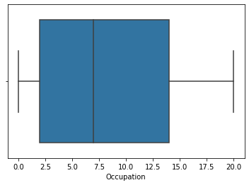


```python
#Use IQR Score to detect outliers
Q1 = train.quantile(0.25)
Q3 = train.quantile(0.75)
IQR = Q3-Q1
IQR
```


    User_ID               2962.0
    Occupation              12.0
    Marital_Status           1.0
    Product_Category_1       7.0
    Product_Category_2      14.0
    Product_Category_3       8.0
    Purchase              6231.0
    dtype: float64


```python
train = train[~((train < (Q1-1.5*IQR))|(train >(Q3+1.5*IQR))).any(axis = 1)]
train.shape
```


    (543238, 12)


<a id='Exploratory Data Analysis'></a>
### Exploratory Data Analysis (EDA)
This section is to explore the purchase distribution with different variables, and the relationship between different variables.

First of all, let's see how the target variable distributed.

### Distribution of the Target Variable


```python
# Distribution of the target variable
plt.figure(figsize=(12,7))
sns.distplot(train.Purchase, bins = 30)
plt.xlabel("Amount spent in Purchase")
plt.ylabel("Number of Buyers")
plt.title("Purchase amount Distribution")
```


    Text(0.5, 1.0, 'Purchase amount Distribution')


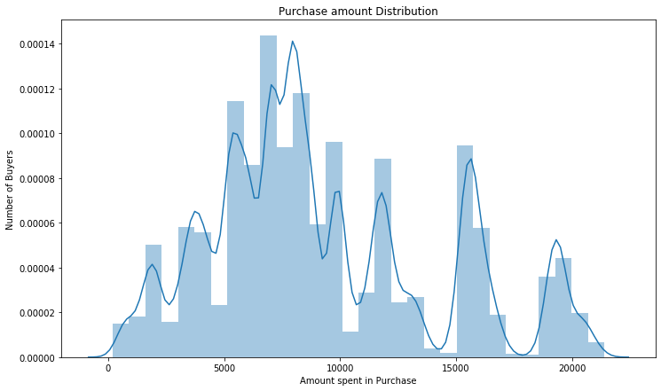


The function skewtest return a value of 0.58, which means that there is more weight in the left tail of the distribution.


```python
print ("Skew is:", train.Purchase.skew())
print("Kurtosis: %f" % train.Purchase.kurt())
```

    Skew is: 0.5890182202556025
    Kurtosis: -0.432178


### Relations Between Different Variables
Before exploring the relationship between different variables, we will joint the data set and remove the unrelevant information.


```python
#joining data set
train["source"]= "train"
test["source"]="test"
data = pd.concat([train,test], ignore_index = True, sort = False)
data.shape
```


    (776837, 13)


```python
#Removing unrelevant columns
data.drop(['User_ID','Product_ID'],axis = 1,inplace = True)
```


```python
data.fillna(0,inplace = True)
```

The heatmap shows the relationship between different variables are not significant.


```python
#plot different features against one another with heatmap function

plt.figure(figsize = (20,10))
c=data.corr()
sns.heatmap(c,cmap ="BrBG", annot = True)
c
```


<div>
<style scoped>
    .dataframe tbody tr th:only-of-type {
        vertical-align: middle;
    }

    .dataframe tbody tr th {
        vertical-align: top;
    }

    .dataframe thead th {
        text-align: right;
    }
</style>
<table border="1" class="dataframe">
  <thead>
    <tr style="text-align: right;">
      <th></th>
      <th>Occupation</th>
      <th>Marital_Status</th>
      <th>Product_Category_1</th>
      <th>Product_Category_2</th>
      <th>Product_Category_3</th>
      <th>Purchase</th>
    </tr>
  </thead>
  <tbody>
    <tr>
      <th>Occupation</th>
      <td>1.000000</td>
      <td>0.023455</td>
      <td>-0.009595</td>
      <td>0.007460</td>
      <td>0.012734</td>
      <td>0.011615</td>
    </tr>
    <tr>
      <th>Marital_Status</th>
      <td>0.023455</td>
      <td>1.000000</td>
      <td>0.019901</td>
      <td>0.003240</td>
      <td>-0.005349</td>
      <td>-0.001177</td>
    </tr>
    <tr>
      <th>Product_Category_1</th>
      <td>-0.009595</td>
      <td>0.019901</td>
      <td>1.000000</td>
      <td>-0.042964</td>
      <td>-0.391103</td>
      <td>-0.198848</td>
    </tr>
    <tr>
      <th>Product_Category_2</th>
      <td>0.007460</td>
      <td>0.003240</td>
      <td>-0.042964</td>
      <td>1.000000</td>
      <td>0.089298</td>
      <td>0.013200</td>
    </tr>
    <tr>
      <th>Product_Category_3</th>
      <td>0.012734</td>
      <td>-0.005349</td>
      <td>-0.391103</td>
      <td>0.089298</td>
      <td>1.000000</td>
      <td>0.169551</td>
    </tr>
    <tr>
      <th>Purchase</th>
      <td>0.011615</td>
      <td>-0.001177</td>
      <td>-0.198848</td>
      <td>0.013200</td>
      <td>0.169551</td>
      <td>1.000000</td>
    </tr>
  </tbody>
</table>
</div>


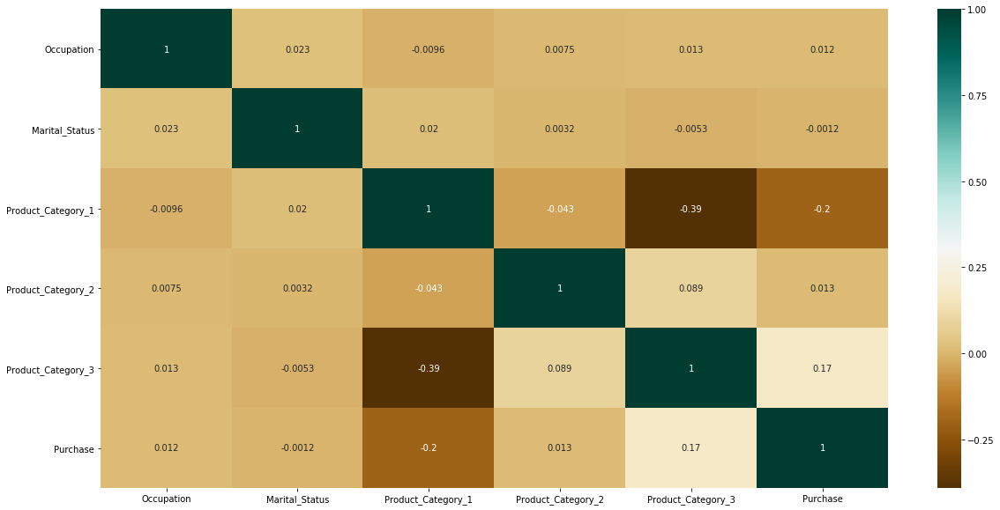


### Relationship Between Target and Variables


```python
#Scatter Plot to show relations against features
train_product = sns.scatterplot(x="Product_Category_1", y="Purchase", hue="Gender",data=data)
train_product
```


    <matplotlib.axes._subplots.AxesSubplot at 0x1a1e835dd8>


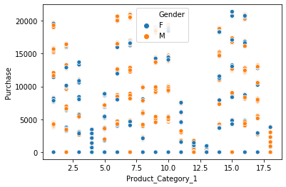


```python
# Avg. Purchase against variables
#Age
Age_pivot = \
train.pivot_table(index='Age', values="Purchase",columns = "Gender", aggfunc=np.mean)
Age_pivot.plot(kind='line',figsize=(12,7))
plt.xlabel("Age")
plt.ylabel("Purchase")
plt.title("Age and Purchase Analysis")
plt.xticks(rotation=0)
plt.show()
```


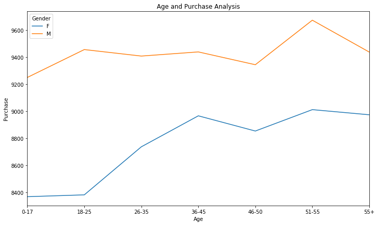


```python
# Avg. Purchase against variables
# Occupation
Occupation_pivot = \
train.pivot_table(index='Occupation', values="Purchase", columns = "Gender", aggfunc=np.mean)
Occupation_pivot.plot(kind='bar',figsize=(12,7))
plt.xlabel("Occupation")
plt.ylabel("Purchase")
plt.title("Occupation and Purchase Analysis")
plt.xticks(rotation=0)
plt.show()
```


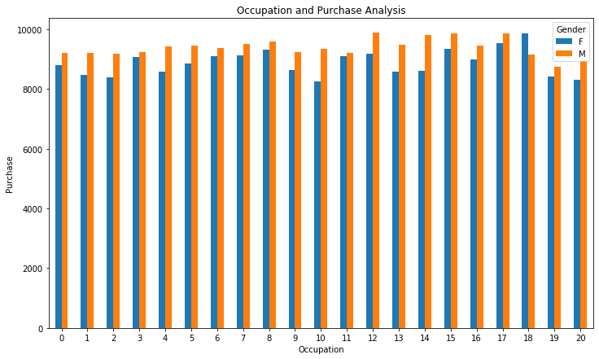


```python
# Avg. Purchase against variables
# Product_Category_1
Product_Category_1_pivot = \
train.pivot_table(index='Product_Category_1', values="Purchase", columns = "Gender", aggfunc=np.mean)
Product_Category_1_pivot.plot(kind='bar',figsize=(12,7))
plt.xlabel("Product_Category_1")
plt.ylabel("Purchase")
plt.title("Product_Category_1 and Purchase Analysis")
plt.xticks(rotation=0)
plt.show()
```


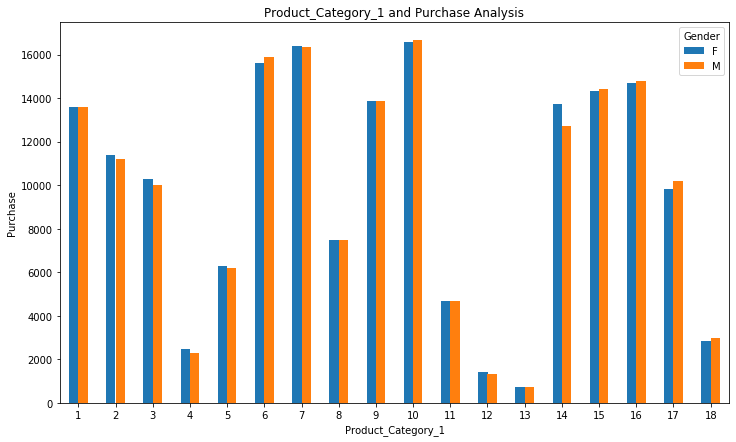


```python

# Avg. Purchase against variables
# City_Category
City_Category_pivot = \
train.pivot_table(index='City_Category', values="Purchase", columns = "Gender", aggfunc=np.mean)
City_Category_pivot.plot(kind='bar',figsize=(12,7))
plt.xlabel("City_Category")
plt.ylabel("Purchase")
plt.title("City_Category and Purchase Analysis")
plt.xticks(rotation=0)
plt.show()
```


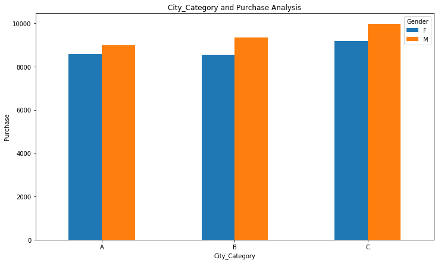


```python
# Avg. Purchase against variables
#Stay_In_Current_City_Years
Stay_In_Current_City_Years_pivot = \
train.pivot_table(index='Stay_In_Current_City_Years', values="Purchase", columns = "Gender", aggfunc=np.mean)
Stay_In_Current_City_Years_pivot.plot(kind='bar',figsize=(12,7))
plt.xlabel("Stay_In_Current_City_Years")
plt.ylabel("Purchase")
plt.title("Stay_In_Current_City_Years and Purchase Analysis")
plt.xticks(rotation=0)
plt.show()
```


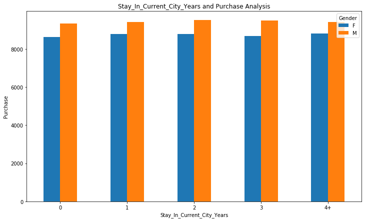


# Distribution of Different Features

We use apply function to count each variable value and visulize them using seaborn countplot function and display the gender with different colours.

* Age: Majority of the buyers are between 26-35 years old, followed by aged 36-45. There are more Male buyer than Female buyers across all age groups.

* Occupation: "0", "4" and "7" are the most popular occupation.

* City: There are more buyers from City "B" while City "A" has the least. Majority of the buyers stayed in the city for 1 years, 


```python
#Use apply function to count each variable value
data.apply(lambda x: len(x.unique()))
```


    Gender                            2
    Age                               7
    Occupation                       21
    City_Category                     3
    Stay_In_Current_City_Years        5
    Marital_Status                    2
    Product_Category_1               18
    Product_Category_2               18
    Product_Category_3               16
    Purchase                      16969
    source                            2
    dtype: int64


```python
sns.countplot(x="Age", data=data)
```


    <matplotlib.axes._subplots.AxesSubplot at 0x1a1fb042b0>


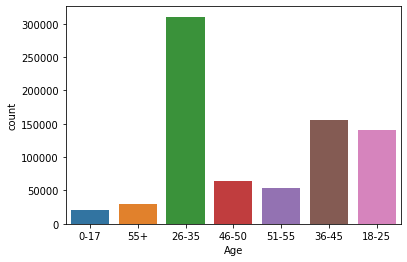


```python
#Distrition of Age variable
sns.countplot(x="Age", data=data, hue="Gender")

```


    <matplotlib.axes._subplots.AxesSubplot at 0x1a35883080>


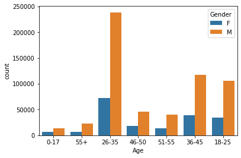


```python
# Distribution of Occupation variables
sns.countplot(x="Occupation", data=data)
```


    <matplotlib.axes._subplots.AxesSubplot at 0x1a202d22e8>


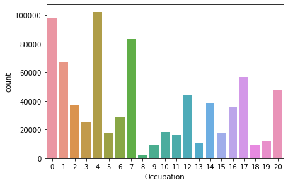


```python
# Distribution of City Category variables
sns.countplot(x="City_Category", data=data, hue="Gender")
```


    <matplotlib.axes._subplots.AxesSubplot at 0x1a200e2748>


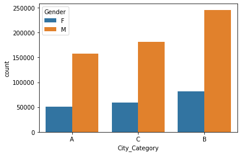


```python
sns.countplot(x="City_Category", data=data)
```


    <matplotlib.axes._subplots.AxesSubplot at 0x1a1ee026d8>


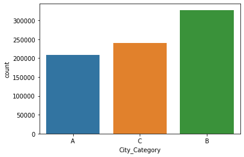


```python
#Distribution of Stay_In_Current_City_Years variables
sns.countplot(x="Stay_In_Current_City_Years", data=data, hue="Gender")
```


    <matplotlib.axes._subplots.AxesSubplot at 0x1a1ebea470>


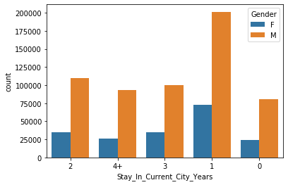


```python
#Distribution of Stay_In_Current_City_Years variables
sns.countplot(x="Stay_In_Current_City_Years", data=data)
```


    <matplotlib.axes._subplots.AxesSubplot at 0x1a29b1d828>


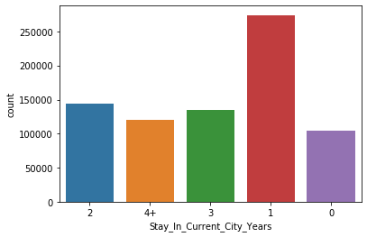


```python
Product_category_1_pivot = \
train.pivot_table(index='Product_Category_1', values="Purchase", aggfunc=np.mean)

Product_category_1_pivot.plot(kind='bar',figsize=(12,7))
```


    <matplotlib.axes._subplots.AxesSubplot at 0x1a1e742518>


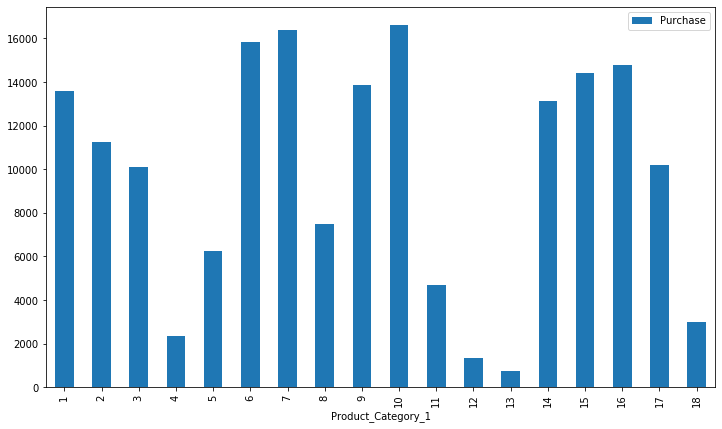


## Encoding Categorical Data


```python
#Converting Gender to binary
gender_dict = {"F":0, "M":1}
data.Gender = data.Gender.apply(lambda line: gender_dict[line])
data.Gender.value_counts()
```


    1    584964
    0    191873
    Name: Gender, dtype: int64


```python
# Giving Age Numerical values
age_dict = {"0-17":0, "18-25":1, "26-35":2, "36-45":3, "46-50":4, "51-55":5, "55+":6}
data.Age = data.Age.apply(lambda line: age_dict[line])
data.Age.value_counts()


```


    2    310628
    3    155294
    1    140883
    4     64643
    5     54140
    6     30134
    0     21115
    Name: Age, dtype: int64


```python
#Converting City_Category to binary
city_dict = {"A":0, "B":1, "C":2}
data.City_Category = data.City_Category.apply(lambda line: city_dict[line])
data.City_Category.value_counts()
```


    1    327465
    2    240553
    0    208819
    Name: City_Category, dtype: int64


```python
# Stay_In_Current_City_Years value formatting
data.Stay_In_Current_City_Years.replace("4+", 4,inplace = True)
data.Stay_In_Current_City_Years.value_counts()
data.Stay_In_Current_City_Years = data.Stay_In_Current_City_Years.astype("int64",inplace = True)
data.Stay_In_Current_City_Years.value_counts()
```


    1    273961
    2    144145
    3    134269
    4    119650
    0    104812
    Name: Stay_In_Current_City_Years, dtype: int64


```python
data.Product_Category_2 = data.Product_Category_2.astype("int64",inplace = True)
data.Product_Category_3 = data.Product_Category_3.astype("int64",inplace = True)

```


```python
data.dtypes
```


    Gender                          int64
    Age                             int64
    Occupation                      int64
    City_Category                   int64
    Stay_In_Current_City_Years      int64
    Marital_Status                  int64
    Product_Category_1              int64
    Product_Category_2              int64
    Product_Category_3              int64
    Purchase                      float64
    source                         object
    dtype: object


<a id='Modeling'></a>
# Modeling

### Features and Labels and Convert Data to Arrays

We separate the data into the features and targets. The target, also known as the label, is the value we want to predict


```python
# Labels are the values we want to predict
labels = np.array(data['Purchase'])

# Remove the labels
# axis 1 refers to the columns
data_feature= data.drop('Purchase', axis = 1)

# Saving feature names for later use
data_list = list(data_feature.columns)

# Convert to numpy array
data_feature = np.array(data_feature)
```

### Train and Test Set


```python
train_data = data.loc[data['source']=="train"]
test_data = data.loc[data['source']=="test"]
```


```python
train_labels = train_data.Purchase
test_labels = test_data.Purchase
```


```python

train_features = train_data.drop(['Purchase','source'],axis = 1)

test_features = test_data.drop(['Purchase','source'],axis = 1)

```


```python
# Saving feature names for later use
features_list = list(train_features.columns)
# Convert to numpy array
train_features = np.array(train_features)
test_features = np.array(test_features)
train_labels = np.array(train_labels)
test_labels = np.array(test_labels)
```

### Train Models


```python
# # Import the model we are using
 from sklearn.ensemble import RandomForestRegressor

# # Instantiate model 
 rf = RandomForestRegressor(n_estimators= 100, random_state=42)
    
##Fit the algorithm on the data

 rf.fit(train_features, train_labels);
```


    RandomForestRegressor(bootstrap=True, criterion='mse', max_depth=None,
                          max_features='auto', max_leaf_nodes=None,
                          min_impurity_decrease=0.0, min_impurity_split=None,
                          min_samples_leaf=1, min_samples_split=2,
                          min_weight_fraction_leaf=0.0, n_estimators=100,
                          n_jobs=None, oob_score=False, random_state=42, verbose=0,
                          warm_start=False)


```python
#Predict training set:
train_predictions = rf.predict(train_features)
test_predictions = rf.predict(test_features)
```


```python
test_data.loc[:,"Purchase"] = test_predictions

#Test Predition Distrubtion
plt.figure(figsize=(12,7))
sns.distplot(test_data.Purchase, bins = 30)
plt.xlabel("Amount spent in Purchase")
plt.ylabel("Number of Buyers")
plt.title("Purchase amount Distribution")
```

    /anaconda3/lib/python3.6/site-packages/pandas/core/indexing.py:543: SettingWithCopyWarning: 
    A value is trying to be set on a copy of a slice from a DataFrame.
    Try using .loc[row_indexer,col_indexer] = value instead
    
    See the caveats in the documentation: http://pandas.pydata.org/pandas-docs/stable/indexing.html#indexing-view-versus-copy
      self.obj[item] = s


    Text(0.5, 1.0, 'Purchase amount Distribution')


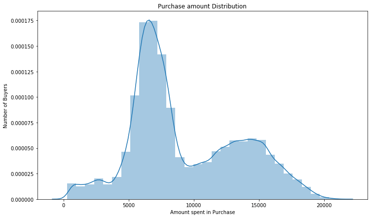

